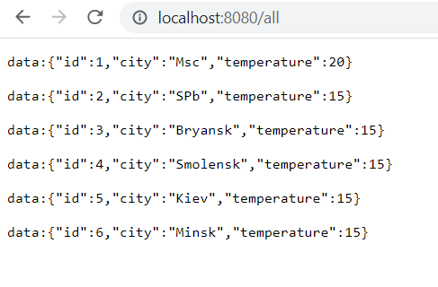
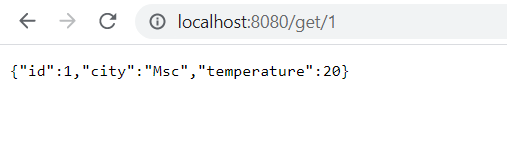
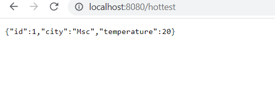
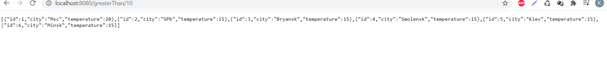

# weather_reactive
## Описание проекта
Приложение - прогноз погоды. Работать оно будет в режиме реактивного программирования.
Это простое демонстрационное приложение погоды, которое включает в себя пример реализации реактивного программирования на WebFlux. Мы можем получить список погодных условий, а также максимальную температуру и отфильтровать их по заданному минимальному параметру.
В приложении будет два запроса.

1. Показать список всех городов с погодой.

2. Показать детальную погоду по выбранному городу.

## Используемые технологии
* Java 15
* Spring(boot/WebFlux)
* Gradle

## Функциональность REST API
1. /all - показывает список всех городов

2./get/{id} - показывает город по его id

3./hottest - показывает город с самой тёплой температурой

4./greaterThan/{temp} - показывает города, где температура выше чем заданное значение

